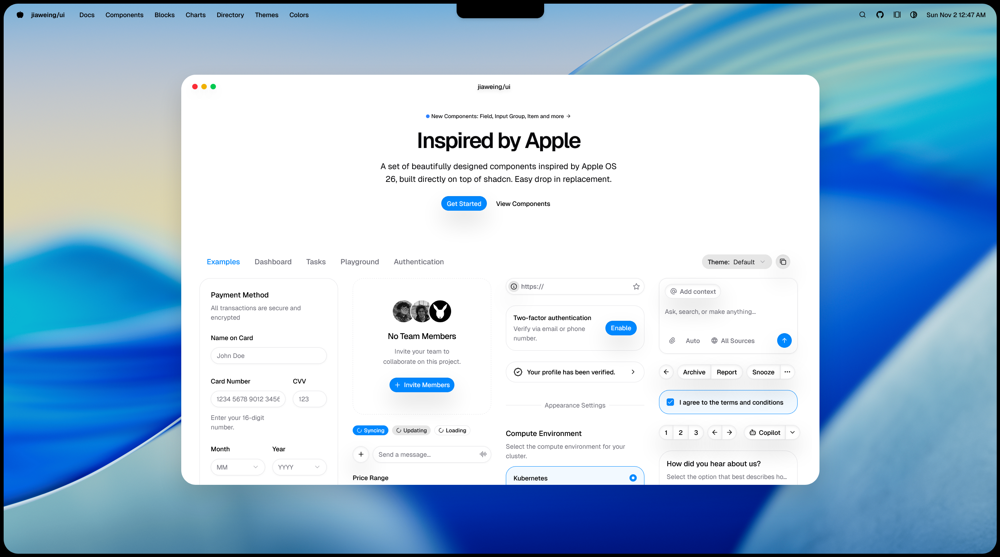

<table width="100%">
  <tr>
    <td align="center" width="120">
      
    </td>
    <td align="right">
      <h1>jiaweing/ui</h1>
      <h3 style="margin-top: -10px;">A set of beautifully designed components inspired by Apple OS 26, built directly on top of shadcn. Easy drop in replacement.</h3>
    </td>
  </tr>
</table>

<table width="100%">
  <tr>
    <td align="center" width="35%">
      
    </td>
    <td align="center" width="10%">
      
    </td>
  </tr>
</table>

*This is not meant to be an exact copy of the Apple UI, but to create something that looks similar. This is a fork of shadcn/ui which will often get merged with upstream commits.*

## Documentation

Visit http://ui.jiaweing.com/docs to view the documentation.

## Contributing

Please read the [contributing guide](/CONTRIBUTING.md).

## License

Licensed under the [MIT license](https://github.com/jiaweing/ui/blob/main/LICENSE.md).
